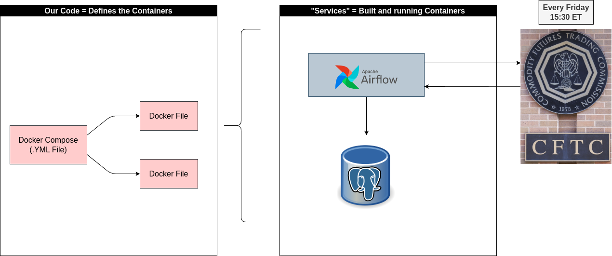

# Docker_Airflow_Postgres
Starter Setup for Dockerized Airflow and Postgres

We will pull publickly available Commodity Futures Trading Commission data.

On every Friday 15:30 US/Eastern time, an airflow DAG will pull the data in local database.



# Preparation

1. git clone this repo
2. make a copy of .env_sample.txt and rename it to .env
3. run the following shell code and place the value in .env (to avoid Linux permission error)
````
echo -e "AIRFLOW_UID=$(id -u)" 
````
4. build and run docker containers
````
docker compose up --build -d 
````
5. to remove everything (done testing)
````
docker compose down
````


# Considerations

1. Airflow and the database should probably live in separate repositories (separation of concerns)
2. There is a lot of ways to configure Aiflow DAG's -> this is a great book on the topic: https://www.amazon.co.uk/Data-Pipelines-Apache-Airflow-Harenslak/dp/1617296902 
3. The following course was extremely useful for the wide subject of Docker: https://www.udemy.com/share/101Wek/